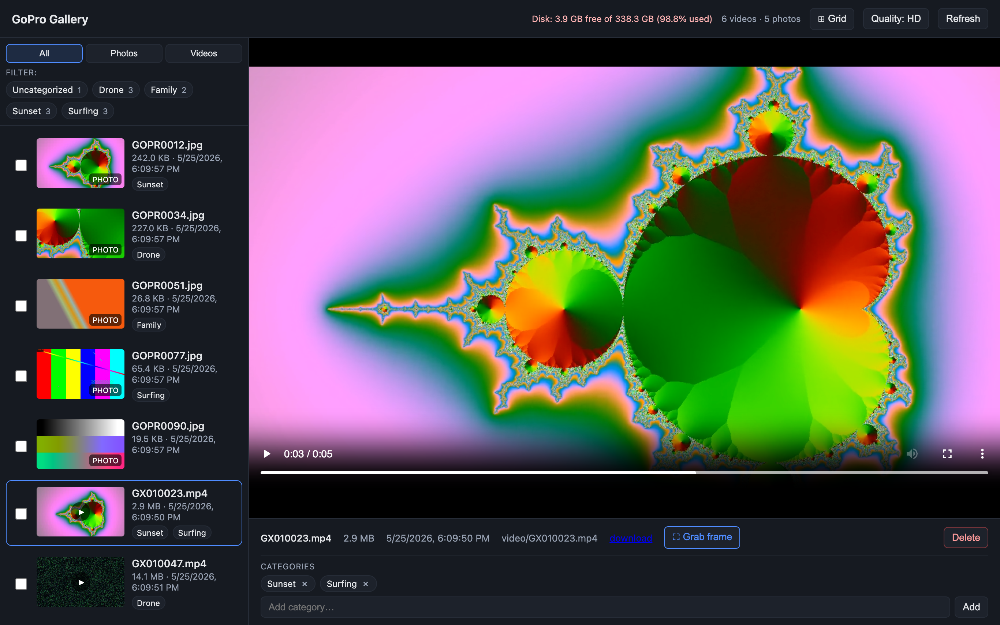
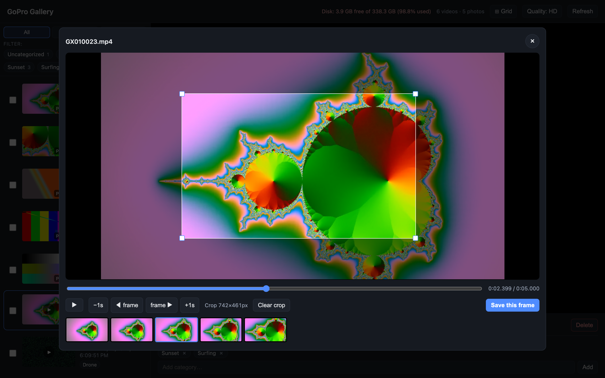
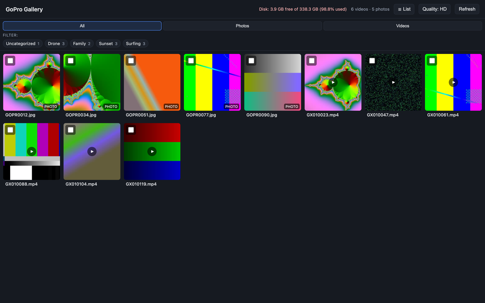

# GoPro Gallery & Export

A small, self-hosted toolkit for getting footage off a GoPro and actually
enjoying it: a one-shot **exporter** that pulls clips off the SD card, and a
fast **media gallery** that streams your videos and photos, tags them into
categories, and lets you **grab and crop a still frame** from any clip.



---

## Features

- **Browse everything in one place** — videos and photos side by side, with
  lazy-loaded thumbnails, a master/detail player, and a thumbnail **grid view**.
- **Grab a frame from any video** — scrub or step frame-by-frame, pick a moment
  from a filmstrip, **crop it**, and save it as a full-resolution photo back into
  the gallery. (See [below](#grab--crop-a-frame).)
- **Categories / tags** — create categories, tag items individually or in bulk,
  and filter the library by them.
- **Bulk actions** — multi-select with click / shift-click / ⌘-click to tag or
  delete many items at once.
- **Plays on phones** — an optional on-the-fly 720p transcode for slow links,
  toggleable per session.
- **Range-request streaming** — proper `Range` support so seeking in long clips
  is instant.
- **Disk awareness** — shows free space on the served volume.
- **SD-card exporter** — copy (and optionally delete) clips and their
  `.LRV`/`.THM`/`.WAV` sidecars, with size-verified, skip-if-present copies.

---

## How it works

Two cooperating processes:

```
 browser ──▶  Express gallery (gallery/server.js)  ──▶  Python REST API (gopro.py serve)
              static UI + /api/* reverse proxy            media scan · thumbnails · transcode · frames
```

- **`gopro.py serve`** is a dependency-free Python HTTP service. It scans the
  media root, generates and caches thumbnails / mobile transcodes / extracted
  frames with **ffmpeg**, and stores category tags in a small SQLite database.
- **`gallery/server.js`** serves the static UI and reverse-proxies `/api/*` to
  the Python service, so the browser only ever talks to one origin.

---

## Requirements

- **Python 3.10+** (standard library only — no `pip install` needed)
- **Node.js 18+** (the gallery UI uses a single dependency, `express`)
- **ffmpeg** on your `PATH` (thumbnails, mobile transcodes, and frame grabs)

---

## Quick start

```bash
git clone https://github.com/RobertsMattL/gopro.git
cd gopro

# 1. Point the gallery at your media and pick ports (see Configuration below)
$EDITOR gopro.conf            # set MEDIA_DIR=...

# 2. Start the API + gallery (installs gallery deps on first run)
./start.sh                    # restart|start|stop|status

# 3. Open the gallery
open http://localhost:3000
```

The media root is expected to contain `images/` and/or `video/` subdirectories;
if neither exists, the whole folder is scanned flat.

```
<MEDIA_DIR>/
├── images/   # .jpg .png .gif .webp .bmp .tif …
└── video/    # .mp4 .mov .m4v
```

---

## Grab & crop a frame

Open any video and click **⛶ Grab frame**. In the picker you can:

- **Scrub** the timeline or **step** by ±1 second / ±1 frame (`←` / `→`),
- click a thumbnail in the **filmstrip** to jump to that moment,
- **drag a crop box** over the frame (move it, resize from the corners, or
  *Clear crop* to keep the full frame),
- hit **Save this frame** — the chosen frame is extracted server-side at
  **full source resolution** (cropped if you selected a region) and saved as a
  new photo in the gallery.



> The picker always loads the original-quality stream and extracts from the
> source file, so saved frames are full resolution regardless of the
> HD/Mobile quality toggle.

---

## Grid view

Toggle **⊞ Grid** for a contact-sheet of thumbnails; click any tile to open it
in a fullscreen lightbox (arrow keys / `Esc` to navigate).



---

## Exporting from an SD card

Copy footage off a card (or any folder) into a destination directory:

```bash
# Preview what would be copied
python3 gopro.py export /Volumes/GOPRO/DCIM ~/Footage --dry-run

# Copy videos (skips files already present at the destination)
python3 gopro.py export /Volumes/GOPRO/DCIM ~/Footage

# Copy, then delete the originals (and their .LRV/.THM/.WAV sidecars)
python3 gopro.py export /Volumes/GOPRO/DCIM ~/Footage --delete -y
```

Useful flags: `--include-aux` (also copy sidecars), `--ext mp4 --ext 360`
(override extensions), `--dry-run`, `-y` (skip the delete confirmation).

---

## Command reference

`gopro.py serve <directory>` options:

| Flag | Default | Description |
| --- | --- | --- |
| `--host` | `127.0.0.1` | Bind address |
| `--port` | `8787` | Bind port |
| `--cache-dir` | `<dir>/.thumbnails` | Where thumbnails/transcodes/frames are cached |
| `--db` | `<cache-dir>/categories.db` | SQLite categories database |
| `--seek` | `1.0` | Seconds into a video to grab its list thumbnail |
| `--thumb-width` | `480` | Thumbnail width (px) |
| `--mobile-height` | `720` | Vertical resolution for the mobile transcode |
| `--mobile-crf` | `23` | x264 CRF for the mobile transcode (lower = better/larger) |
| `--prewarm` | off | Pre-generate all thumbnails on startup |

---

## REST API

All endpoints are served under `/api` and reverse-proxied by the gallery.
`<id>` is the URL-safe base64 of an item's path relative to the media root.

| Method | Endpoint | Purpose |
| --- | --- | --- |
| `GET` | `/api/media` | List all media (videos + photos) with metadata + categories |
| `GET` | `/api/storage` | Disk usage of the served volume |
| `GET` | `/api/thumbnails/<id>` | Cached JPEG thumbnail |
| `GET` | `/api/stream/<id>` | Stream a video (`?q=mobile` for the 720p transcode) |
| `GET` | `/api/image/<id>` | Serve a full-size photo |
| `GET` | `/api/frames/<id>?t=<s>&w=<px>` | Preview JPEG of a frame at time `t` (filmstrip) |
| `POST` | `/api/frames/<id>` | Save a frame — body `{ "t": <s>, "crop"?: {x,y,w,h} }` (fractions 0–1) |
| `GET` / `POST` | `/api/categories` | List / create categories |
| `POST` | `/api/videos/<id>/categories` | Attach a category (`{name}` or `{id}`) |
| `DELETE` | `/api/videos/<id>/categories/<catId>` | Detach a category |
| `DELETE` | `/api/videos/<id>` | Delete a media file (+ thumbnail, transcode, tags, sidecars) |

---

## Configuration

`start.sh` reads `gopro.conf` (POSIX shell syntax) on every run:

```sh
MEDIA_DIR="/Volumes/LaCie/media"   # media root served by the gallery
API_HOST="127.0.0.1"               # Python REST API bind host
API_PORT="8787"                    # Python REST API bind port
GALLERY_PORT="3000"                # Node gallery UI port (listens on all interfaces)
PYTHON="python3"                   # interpreter used to launch the API
```

Override the config path with `GOPRO_CONFIG=/path/to/conf ./start.sh`.

---

## Project layout

```
gopro.py            # export + serve (REST API, thumbnails, transcode, frames)
start.sh            # start/stop/restart the API + gallery, driven by gopro.conf
gopro.conf          # your settings
gallery/
├── server.js       # Express static server + /api reverse proxy
└── public/         # UI (index.html, app.js, style.css)
docs/               # screenshots used in this README
```

---

## Notes

- Caches (`.thumbnails/`) and the categories DB are created under the media root
  by default and are safe to delete — they regenerate on demand.
- Category tags are keyed by a file's path relative to the media root; renaming a
  file on disk drops its tags.
- Frame cropping maps via the source frame's intrinsic dimensions, which assumes
  the browser and ffmpeg agree on orientation (true for upright footage).
